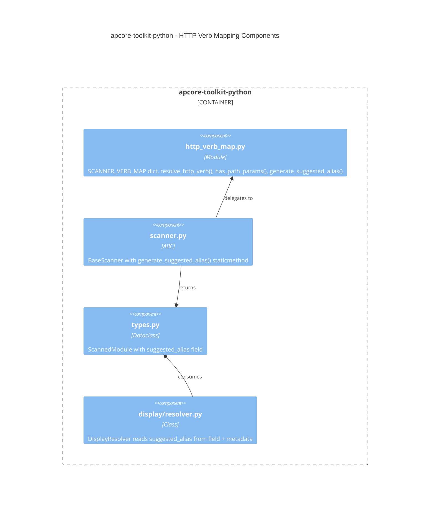
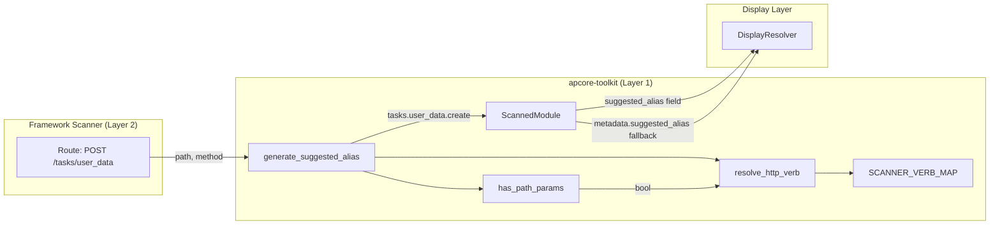
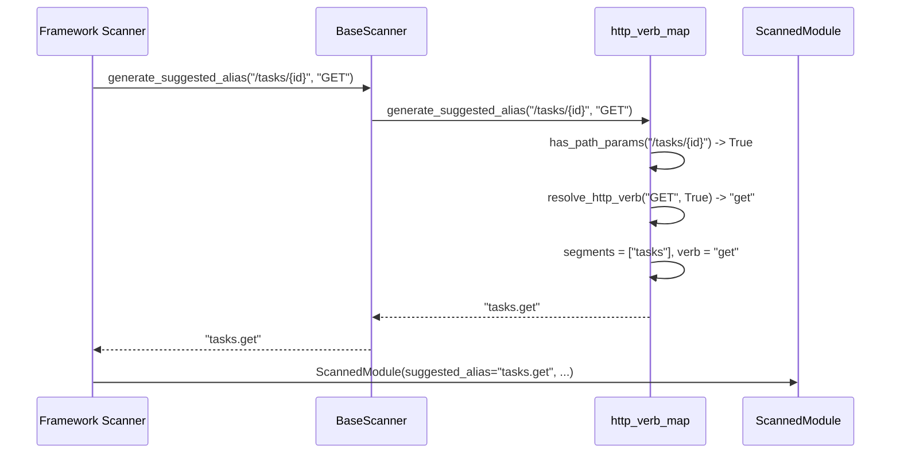
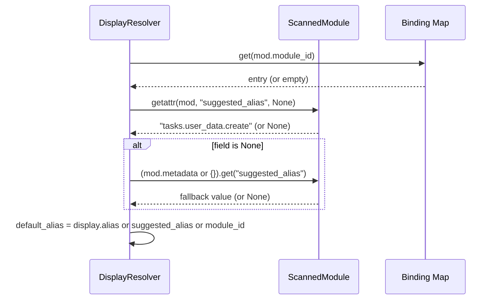

# Technical Design: HTTP Verb Semantic Mapping

**Status**: Draft
**Version**: 1.0
**Date**: 2026-04-16
**Author**: Architecture Team
**Package**: apcore-toolkit-python v0.5.0
**Upstream Reference**: `apcore-cli/ideas/cli-naming-convention.md`

---

## 1. Problem Statement

### 1.1 Current Behavior

Framework scanners (fastapi-apcore, django-apcore, flask-apcore, nestjs-apcore, axum-apcore) generate module IDs that embed raw HTTP methods as command suffixes:

```
POST   /tasks/user_data      ->  module_id: tasks.user_data.post
GET    /tasks/user_data      ->  module_id: tasks.user_data.get
DELETE /tasks/user_data/{id} ->  module_id: tasks.user_data.delete
```

This leaks transport-layer semantics into user-facing command names. Industry CLIs (kubectl, gh, aws, gcloud, docker) universally use semantic verbs (`create`, `list`, `get`, `update`, `delete`) rather than HTTP methods.

### 1.2 Scope

This design covers changes **within apcore-toolkit-python only**. It does not cover CLI-layer kebab-case normalization (Layer 5) or downstream scanner integration, which are separate work items.

Specifically, this design introduces:

1. A new standalone module `http_verb_map.py` providing the canonical verb mapping table and utility functions.
2. A `@staticmethod` convenience method on `BaseScanner`.
3. A new top-level field `suggested_alias` on `ScannedModule`.
4. A backward-compatible update to `DisplayResolver` to read `suggested_alias` from both the new field and the legacy `metadata["suggested_alias"]` location.

### 1.3 Goals

- **G1**: Provide a single source of truth for HTTP-to-semantic-verb mapping across all Python scanners.
- **G2**: Enable scanners to emit a `suggested_alias` field that surfaces human-friendly command names.
- **G3**: Maintain full backward compatibility -- no existing API changes, purely additive.
- **G4**: Ensure cross-language conformance via a shared JSON test fixture.

### 1.4 Non-Goals

- CLI-layer `snake_case` to `kebab-case` normalization (belongs in surface adapters).
- Changes to PROTOCOL_SPEC or binding.yaml schema.
- Automatic migration of existing module IDs.

---

## 2. Solution Alternatives

### 2.1 Alternative A: Standalone Module in apcore-toolkit (Selected)

Add `http_verb_map.py` as a new module in `apcore_toolkit/` containing `SCANNER_VERB_MAP`, `resolve_http_verb()`, `has_path_params()`, and `generate_suggested_alias()`. Add a thin `@staticmethod` wrapper on `BaseScanner` for convenience.

**Strengths**:
- Single source of truth for all Python scanners.
- Matches existing toolkit architecture (flat module layout, stateless utilities).
- Directly importable by scanners without instantiating `BaseScanner`.
- Clear separation: standalone module owns the logic, `BaseScanner` delegates to it.

**Weaknesses**:
- Adds one new module to the package.

### 2.2 Alternative B: Inline in BaseScanner Only

Add all functions directly as `@staticmethod` methods on `BaseScanner`. No standalone module.

**Strengths**:
- No new files. Consistent with existing `infer_annotations_from_method()` pattern.

**Weaknesses**:
- Forces callers to import `BaseScanner` just to call a pure function.
- Makes unit testing less clean (testing statics on an ABC).
- Harder for non-scanner code (e.g., output writers, tests) to access the verb map.
- `SCANNER_VERB_MAP` as a class-level constant on an ABC is awkward.

### 2.3 Alternative C: Embed in Each Scanner Independently

Each framework scanner (fastapi-apcore, django-apcore, etc.) maintains its own verb map.

**Strengths**:
- No shared dependency changes.

**Weaknesses**:
- 3 Python scanners x identical logic = guaranteed drift.
- Violates the stated purpose of apcore-toolkit ("shared scanner utilities").
- Cross-language conformance becomes impossible to enforce centrally.

### 2.4 Comparison Matrix

| Criterion                | A: Standalone Module | B: BaseScanner Only | C: Per-Scanner |
|--------------------------|:-------------------:|:-------------------:|:--------------:|
| Single source of truth   | Yes                 | Yes                 | No             |
| Clean import path        | Yes                 | No (ABC import)     | N/A            |
| Unit test isolation      | Yes                 | Partial             | Yes            |
| Existing pattern match   | Yes (flat modules)  | Yes (staticmethod)  | No             |
| Cross-scanner consistency| Yes                 | Yes                 | No             |
| New files added          | 1                   | 0                   | 0 in toolkit   |
| Backward compatible      | Yes                 | Yes                 | Yes            |

**Decision**: Alternative A. The standalone module provides clean imports, testability, and matches the flat-module architecture. The `BaseScanner` convenience method bridges to the existing pattern for scanners that already subclass it.

---

## 3. Architecture

### 3.1 Ecosystem Layer Placement

```
Layer 0: apcore (Core SDK)
         Protocol runtime, Registry, Executor
         No changes.

Layer 1: apcore-toolkit (This Package)              <-- CHANGES HERE
         Shared scanner logic, schema extraction
         NEW: SCANNER_VERB_MAP, resolve_http_verb(),
              has_path_params(), generate_suggested_alias()
         NEW: ScannedModule.suggested_alias field
         UPDATE: DisplayResolver reads suggested_alias from field

Layer 2: Framework Scanners (downstream consumers)
         fastapi-apcore, django-apcore, flask-apcore
         Will call toolkit.generate_suggested_alias()
         (separate work item, not in this design)

Layer 5: Surface Adapters
         apcore-cli applies kebab-case normalization
         (separate work item, not in this design)
```

### 3.2 Component Diagram (C4 - Container Level)



### 3.3 Data Flow Diagram



### 3.4 Alias Resolve Chain (Updated)

```
display.cli.alias  -->  display.default.alias  -->  suggested_alias  -->  module_id
   (binding.yaml)       (binding.yaml)             (ScannedModule      (canonical,
                                                     field OR             immutable)
                                                     metadata fallback)
```

The `DisplayResolver` now checks `mod.suggested_alias` (the new top-level field) first, falling back to `(mod.metadata or {}).get("suggested_alias")` for backward compatibility with scanners that have not yet been updated.

---

## 4. Detailed Component Specifications

### 4.1 http_verb_map.py

**Location**: `src/apcore_toolkit/http_verb_map.py`

This module is the single source of truth for HTTP verb semantic mapping. It contains no classes, only module-level constants and pure functions.

#### 4.1.1 SCANNER_VERB_MAP

```python
SCANNER_VERB_MAP: dict[str, str] = {
    "GET":     "list",
    "GET_ID":  "get",
    "POST":    "create",
    "PUT":     "update",
    "PATCH":   "patch",
    "DELETE":  "delete",
    "HEAD":    "head",
    "OPTIONS": "options",
}
```

- Immutable at runtime (convention; not enforced via `MappingProxyType` to keep it simple).
- `GET_ID` is a synthetic key used when a GET route has path parameters.
- Keys are uppercase. Unknown methods fall through to `method.lower()`.

#### 4.1.2 resolve_http_verb()

```python
def resolve_http_verb(method: str, has_path_params: bool) -> str:
```

- **Parameters**:
  - `method`: HTTP method string. Case-insensitive (uppercased internally).
  - `has_path_params`: Whether the route path contains path parameters.
- **Returns**: Semantic verb string.
- **Logic**:
  1. Uppercase `method`.
  2. If `GET` and `has_path_params` is `True`, return `SCANNER_VERB_MAP["GET_ID"]` (`"get"`).
  3. If `GET` and `has_path_params` is `False`, return `SCANNER_VERB_MAP["GET"]` (`"list"`).
  4. Otherwise, return `SCANNER_VERB_MAP.get(method_upper, method.lower())`.
- **Edge cases**:
  - Empty string method: returns `""` (fallback to `method.lower()`).
  - Unknown method (e.g., `"PURGE"`): returns `"purge"`.

#### 4.1.3 has_path_params()

```python
def has_path_params(path: str) -> bool:
```

- **Parameters**:
  - `path`: URL path string (e.g., `"/tasks/{id}"`, `"/users/:user_id"`).
- **Returns**: `True` if the path contains path parameter placeholders.
- **Detection regex**: `r'\{[^}]+\}|:[a-zA-Z_]\w*'`
  - Covers `{param}` (FastAPI/OpenAPI/Django) and `:param` (Express/NestJS/Gin/Axum).
- **Edge cases**:
  - Empty string: returns `False`.
  - Path with only parameters (e.g., `"/{id}"`): returns `True`.
  - Nested braces (e.g., `"/{data:{format}}"`): returns `True` (outer brace matches).

#### 4.1.4 generate_suggested_alias()

```python
def generate_suggested_alias(path: str, method: str) -> str:
```

- **Parameters**:
  - `path`: URL path (e.g., `"/tasks/user_data/{id}"`).
  - `method`: HTTP method (e.g., `"POST"`).
- **Returns**: Dot-separated alias string (e.g., `"tasks.user_data.create"`).
- **Logic**:
  1. Strip leading/trailing `/` from `path`, split on `/`, drop empty strings.
  2. Filter out segments that are path parameters (full-match against the path param regex) to obtain the *non-param* segments.
  3. Determine `is_single_resource`: check whether the **last** segment of the raw (unfiltered) list is a path parameter. This correctly classifies nested collection endpoints — e.g. `GET /orgs/{org_id}/members` yields `"orgs.members.list"` because the last segment `members` is not a param, even though the path contains `{org_id}`.
  4. Resolve semantic verb via `resolve_http_verb(method, is_single_resource)`.
  5. Join non-param segments + verb with `"."`.
- **Edge cases**:
  - Root path `"/"`: segments list is empty, result is just the verb (e.g., `"list"`).
  - Trailing slash `"/tasks/"`: stripped, same as `"/tasks"`.
  - Path with only params `"/{org_id}/{team_id}"`: returns just the verb.
  - Nested collection `GET /orgs/{org_id}/members`: last segment `members` is not a param → `"orgs.members.list"`.

### 4.2 BaseScanner.generate_suggested_alias()

**Location**: `src/apcore_toolkit/scanner.py`

New `@staticmethod` on `BaseScanner`, following the pattern of `infer_annotations_from_method()`.

```python
@staticmethod
def generate_suggested_alias(path: str, method: str) -> str:
    """Generate a human-friendly suggested alias from HTTP route info.

    Delegates to ``http_verb_map.generate_suggested_alias()``.
    Provided as a convenience for scanner subclasses.

    Args:
        path: URL path (e.g., "/tasks/user_data/{id}").
        method: HTTP method (e.g., "POST").

    Returns:
        Dot-separated alias string (e.g., "tasks.user_data.create").
    """
    from apcore_toolkit.http_verb_map import generate_suggested_alias as _generate
    return _generate(path, method)
```

This is a pure delegation method. Logic lives in `http_verb_map.py`.

### 4.3 ScannedModule.suggested_alias

**Location**: `src/apcore_toolkit/types.py`

New optional field on the `ScannedModule` dataclass:

```python
@dataclass
class ScannedModule:
    # ... existing fields ...
    suggested_alias: str | None = None
    # ... existing optional fields ...
```

- **Position**: After `documentation`, before `examples`. This groups it with other optional display-related fields.
- **Default**: `None` (backward compatible -- existing code that constructs `ScannedModule` without this field continues to work).
- **Semantics**: Scanner-generated human-friendly alias. Surface adapters use this in the resolve chain before falling back to `module_id`.

### 4.4 DisplayResolver Update

**Location**: `src/apcore_toolkit/display/resolver.py`

Current code at line 134:

```python
suggested_alias: str | None = (mod.metadata or {}).get("suggested_alias")
```

Updated to check both the field and metadata:

```python
suggested_alias: str | None = (
    getattr(mod, "suggested_alias", None)
    or (mod.metadata or {}).get("suggested_alias")
)
```

- **Precedence**: Top-level field takes precedence over metadata.
- **Backward compatibility**: Scanners emitting `metadata["suggested_alias"]` (legacy path) continue to work.
- **`getattr` usage**: Defensive against non-ScannedModule objects passed to the resolver (the method signature accepts `Any`).

---

## 5. API Specifications

### 5.1 Public API Surface

All new public symbols are re-exported from `__init__.py`:

```python
# New imports in __init__.py
from apcore_toolkit.http_verb_map import (
    SCANNER_VERB_MAP,
    generate_suggested_alias,
    has_path_params,
    resolve_http_verb,
)

# Added to __all__
__all__ = [
    # ... existing entries ...
    "SCANNER_VERB_MAP",
    "generate_suggested_alias",
    "has_path_params",
    "resolve_http_verb",
]
```

### 5.2 Parameter Validation and Boundary Values

| Function | Parameter | Type | Valid Range | Invalid Handling |
|---|---|---|---|---|
| `resolve_http_verb` | `method` | `str` | Any string | Empty string returns `""` |
| `resolve_http_verb` | `has_path_params` | `bool` | `True`/`False` | N/A (bool) |
| `has_path_params` | `path` | `str` | Any string | Empty string returns `False` |
| `generate_suggested_alias` | `path` | `str` | URL path | `"/"` returns verb only |
| `generate_suggested_alias` | `method` | `str` | HTTP method | Unknown methods pass through lowercased |

No exceptions are raised by any of these functions. They are designed to always return a valid string, degrading gracefully for unexpected inputs.

---

## 6. Error Handling

These utility functions are intentionally exception-free. The design philosophy matches `infer_annotations_from_method()` which also never raises:

| Scenario | Behavior |
|---|---|
| Unknown HTTP method (e.g., `"PURGE"`) | Returns `method.lower()` (e.g., `"purge"`) |
| Empty method string | Returns `""` |
| Root path `"/"` | Returns verb only (e.g., `"list"`) |
| Path with only parameters | Returns verb only |
| Non-URL path string | Splits on `/`, filters param-like segments, best-effort result |

The `DisplayResolver` update also does not introduce new error paths. The existing `getattr` fallback handles missing attributes gracefully.

---

## 7. Sequence Diagrams

### 7.1 Scanner Alias Generation Flow



### 7.2 DisplayResolver Alias Resolution Flow



---

## 8. Edge Cases

These are drawn from the upstream solution report and augmented with toolkit-specific considerations.

### 8.1 GET Collection vs GET Single

```
GET /tasks/user_data       -> has_path_params=False -> "list"
GET /tasks/user_data/{id}  -> has_path_params=True  -> "get"
```

No collision: different semantic verbs are produced.

### 8.2 Custom Action Routes (Non-CRUD)

```
POST /tasks/{id}/archive   -> segments=["tasks", "archive"], verb="create"
                            -> alias: "tasks.archive.create"
```

The current `generate_suggested_alias()` implementation does NOT special-case custom actions. It always appends the resolved verb. The upstream report describes a heuristic for detecting non-CRUD routes (section 8.2), but that heuristic is deferred to a future iteration because:

- It requires semantic analysis of the last path segment (is "archive" a noun or a verb?).
- False positives would be worse than a slightly verbose alias.
- `binding.yaml` overrides handle the minority of cases where the auto-generated alias is unsuitable.

### 8.3 API Versioned Routes

```
GET /api/v2/users -> alias: "api.v2.users.list"
```

Version prefixes are preserved in the alias. Surface adapters or `binding.yaml` overrides can strip them if desired.

### 8.4 Nested Resources

```
GET /organizations/{org_id}/teams/{team_id}/members
    -> segments: ["organizations", "teams", "members"]
    -> alias: "organizations.teams.members.list"
```

Path parameters are stripped, resource segments are preserved.

### 8.5 Hyphens in URL Paths

```
GET /user-data/reports -> segments: ["user-data", "reports"]
                       -> alias: "user-data.reports.list"
```

The alias preserves the original path casing/separators. Convention normalization happens at the surface adapter layer.

### 8.6 Express/NestJS Colon Parameters

```
GET /users/:userId/posts/:postId
    -> has_path_params=True (`:userId` matches regex)
    -> segments: ["users", "posts"]
    -> alias: "users.posts.get"
```

### 8.7 Empty or Root Path

```
GET / -> segments: [], verb: "list" -> alias: "list"
```

### 8.8 Mixed Parameter Styles

```
GET /orgs/{org_id}/repos/:repo_name
    -> Both styles matched by regex
    -> segments: ["orgs", "repos"]
    -> alias: "orgs.repos.get"
```

---

## 9. Migration Strategy for Downstream Scanners

### 9.1 Phase 1: Toolkit Release (This Design)

Release `apcore-toolkit-python` v0.5.0 with all components described in this document. This is a purely additive, non-breaking release.

**Checklist**:
- [ ] `http_verb_map.py` module with full test coverage.
- [ ] `BaseScanner.generate_suggested_alias()` staticmethod.
- [ ] `ScannedModule.suggested_alias` field.
- [ ] `DisplayResolver` backward-compatible update.
- [ ] Public API re-exports in `__init__.py`.
- [ ] Conformance fixture at `tests/fixtures/scanner_verb_map.json`.
- [ ] All existing tests pass (no regressions).

### 9.2 Phase 2: Scanner Adoption (Downstream)

Each Python scanner updates to `apcore-toolkit>=0.5.0` and calls `generate_suggested_alias()`:

```python
from apcore_toolkit.http_verb_map import generate_suggested_alias

# In scanner's route processing:
alias = generate_suggested_alias(route.path, route.method)
module = ScannedModule(
    module_id=existing_module_id,  # unchanged
    suggested_alias=alias,         # new field
    ...
)
```

**Backward compatibility**: Scanners that do not set `suggested_alias` continue to work. The `DisplayResolver` falls through to `module_id`.

### 9.3 Phase 3: Cross-Language Parity

TypeScript (`apcore-toolkit-typescript`) and Rust (`apcore-toolkit-rust`) implement the same `SCANNER_VERB_MAP` and validate against the shared conformance fixture. Each language toolkit maintains its own copy of the fixture JSON.

### 9.4 Version Bumping

| Package | Current | New | Change Type |
|---|---|---|---|
| apcore-toolkit-python | 0.4.2 | 0.5.0 | Minor (additive API) |
| fastapi-apcore | (current) | next | Patch (uses new toolkit API) |
| django-apcore | (current) | next | Patch |
| flask-apcore | (current) | next | Patch |

---

## 10. Conformance Fixture

**Location**: `tests/fixtures/scanner_verb_map.json`

```json
[
  {"path": "/tasks/user_data", "method": "POST", "expected_alias": "tasks.user_data.create"},
  {"path": "/tasks/user_data", "method": "GET", "expected_alias": "tasks.user_data.list"},
  {"path": "/tasks/user_data/{id}", "method": "GET", "expected_alias": "tasks.user_data.get"},
  {"path": "/tasks/user_data/{id}", "method": "PUT", "expected_alias": "tasks.user_data.update"},
  {"path": "/tasks/user_data/{id}", "method": "PATCH", "expected_alias": "tasks.user_data.patch"},
  {"path": "/tasks/user_data/{id}", "method": "DELETE", "expected_alias": "tasks.user_data.delete"},
  {"path": "/api/v2/users", "method": "GET", "expected_alias": "api.v2.users.list"},
  {"path": "/health", "method": "GET", "expected_alias": "health.list"},
  {"path": "/users", "method": "POST", "expected_alias": "users.create"},
  {"path": "/users/:user_id", "method": "GET", "expected_alias": "users.get"},
  {"path": "/", "method": "GET", "expected_alias": "list"},
  {"path": "/orgs/{org_id}/teams/{team_id}/members", "method": "GET", "expected_alias": "orgs.teams.members.list"},
  {"path": "/tasks/user_data/{id}", "method": "HEAD", "expected_alias": "tasks.user_data.head"},
  {"path": "/tasks/user_data/{id}", "method": "OPTIONS", "expected_alias": "tasks.user_data.options"}
]
```

Each language toolkit runs this fixture as a parameterized test. All must produce identical output.

---

## 11. Testing Strategy

### 11.1 Unit Tests

| Test File | Coverage Target |
|---|---|
| `tests/test_http_verb_map.py` | All functions in `http_verb_map.py` |
| `tests/test_scanner.py` (additions) | `BaseScanner.generate_suggested_alias()` |
| `tests/test_types.py` (additions) | `ScannedModule.suggested_alias` field |
| `tests/test_display_resolver.py` (additions) | Dual-source alias resolution |

### 11.2 Conformance Tests

`tests/test_http_verb_map.py` loads `tests/fixtures/scanner_verb_map.json` and runs parameterized tests for every entry.

### 11.3 Ruff and Mypy

All new code must pass `ruff check` and `mypy --strict` with zero errors. The module uses `from __future__ import annotations` for PEP 604 union syntax compatibility.

---

## 12. Appendix: Full Module Interface

```python
# src/apcore_toolkit/http_verb_map.py

from __future__ import annotations

import re

__all__ = [
    "SCANNER_VERB_MAP",
    "generate_suggested_alias",
    "has_path_params",
    "resolve_http_verb",
]

SCANNER_VERB_MAP: dict[str, str] = {
    "GET":     "list",
    "GET_ID":  "get",
    "POST":    "create",
    "PUT":     "update",
    "PATCH":   "patch",
    "DELETE":  "delete",
    "HEAD":    "head",
    "OPTIONS": "options",
}

_PATH_PARAM_RE: re.Pattern[str] = re.compile(r"\{[^}]+\}|:[a-zA-Z_]\w*")


def has_path_params(path: str) -> bool: ...
def resolve_http_verb(method: str, has_path_params: bool) -> str: ...
def generate_suggested_alias(path: str, method: str) -> str: ...
```
